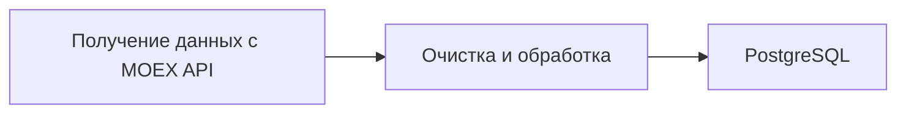

# 📈 Stock Data Service
**Stock Data Service** — это автономный сервис для сбора, обработки и доставки биржевых данных с MOEX API.  
Проект представляет собой модульную ETL-систему (Extract – Transform – Load) для сбора, обработки и хранения биржевых котировок и торговых показателей.
Система автоматически извлекает данные с торговых площадок, очищает и нормализует их, а затем сохраняет в базу данных PostgreSQL.
Для взаимодействия с данными реализован REST API на FastAPI, позволяющий управлять пользователями.

Система полностью автономна и включает в себя:
- 🔍 **Парсер котировок** (цены, объемы, изменения)
- 📦 **Подготовку и сохранение данных** в структурированном виде
- 🔑 **Веб-интерфейс с авторизацией** для пользователя защищенный доступ через логин/пароль
## 🔄 Архитектура процесса


### Главная страница сервиса
<br />
*Простейший веб-интерфейс главной страницы с обзором возможностей сервиса*
## 🔥 Ключевые преимущества для бизнеса
- 📊 **Готовые датасеты** для алготрейдинга, бэктестинга, финансовой аналитики
- ⛓ **Полностью автономный процесс**
---
### Панель администратора
<br />
*Простейшая админка на SQL Admin для внутреннего тестирования. Позже планируется переход на полноценную админку с авторизацией.*
### Форма регистрации пользователя
<br />

### Форма авторизации пользователя
<br />

## 🧑‍💼 Веб-интерфейс личного кабинета пользователя
<br />
*Система включает защищённый веб-интерфейс*

### Структура данных
| Поле | Описание |
|-------|----------|
| id | Уникальный идентификатор записи котировки. |
| ticker | Тикер ценной бумаги|
| name | Полное название ценной бумаги|
| last_price | Последняя цена инструмента на момент обновления|
| prev_price | Цена закрытия предыдущей торговой сессии |
| change | Изменение цены относительно предыдущего закрытия|
| change_percent | Процентное изменение цены относительно предыдущего закрытия|
| open | Цена открытия текущей торговой сессии|
| high | Максимальная цена за текущую торговую сессию|
| low    | Минимальная цена за текущую торговую сессию|
| volume | Объём торгов в штуках (количество купленных/проданных лотов)|
| value  | Общая стоимость совершённых сделок|
| update_time | Время последнего обновления котировки|
| lot_size | Количество единиц инструмента в одном лоте (стандартный размер лота)|

---


## 🛠️ Технологии

| Модуль          | Описание                          |
|-----------------|-----------------------------------|
| `requests`      |Получение биржевых данных через HTTP API|
| `FastAPI`| Создание веб-интерфейса|
| `authx`| Управление аутентификацией и авторизацией пользователей, генерация и проверка токенов безопасности|
| `bcrypt`| Хеширование пароля|
| `sqladmin`|Веб-интерфейс для администрирования базы данных|
| `SQLAlchemy`| Работа с PostgreSQL через ORM и выполнение SQL-запросов|
| `pandas`| Обработка и очистка данных|
| `schedule`| Планировщик задач |
| `zipfile`| Архивирование файлов|
| `smtplib`| Работа с SMTP-протоколом|
| `pytest`| Тестирование и автоматизация тестов|
---

## 📁 Структура проекта
```text
Stock-Data-Service/
├── src/                          # Основной код приложения
│   ├── __init__.py
│   ├── main.py                   # FastAPI приложение
│   ├── scheduler.py              # Планировщик задач
│   ├── admin_panel/              # Панель администратора
│   │   ├── __init__.py
│   │   └── views.py
│   ├── auth/                     # Авторизация и регистрация
│   │   ├── __init__.py
│   │   ├── schemas.py
│   │   ├── service.py
│   │   └── user_router.py
│   ├── core/                     # Основной роутер и бизнес-логика
│   │   ├── __init__.py
│   │   └── router.py
│   ├── db/                       # Работа с базой данных
│   │   ├── __init__.py
│   │   ├── database.py
│   │   ├── crud.py
│   ├── email/                    # Логика отправки email
│   │   ├── __init__.py
│   │   ├── router.py
│   │   └── service.py
│   ├── quotes/                  # Отображение данных
│   │   ├── __init__.py
│   │   ├── router.py
│   ├── parsing/                  # Парсинг и обработка данных
│   │   ├── __init__.py
│   │   ├── data_archiver.py
│   │   ├── data_parser.py
│   │   └── data_processor.py
│   ├── recipients/               # Роутеры для получателей
│   │   ├── __init__.py
│   │   └── router.py
│   └── static/                   # Статические файлы (css, js, изображения)
├── templates/                    # Jinja2 шаблоны
│   ├── base.html
│   ├── index.html
│   ├── login.html
│   ├── signup.html
│   └── user.html
│   └── about.html
├── tests/                        # Тесты
│   ├── __init__.py
│   └── test_data_processor.py
├── Dockerfile                    # Контейнеризация
├── docker-compose.yml            # Сборка и запуск контейнеров
├── .env                          # Файл с переменными окружения
├── run_parser.py                 # Основной скрипт запуска
└── requirements.txt              # Зависимости проекта
```
---
### Осознанные ограничения
- ⏳ Время работы: 10:00–19:00 (по будням)
- 🔁 Интервал проверки: 10 минут

---
## 🚀 Быстрый старт
1. Клонирование репозитория:
 ```
https://github.com/fetgrigory/mfd-mos-stock-parser.git
   ```
2. Подключение к базе данных на PostgreSQL
Для работы с базой данных требуется указать параметры подключения в файле ".env":

- **HOST**: Адрес хоста базы данных.
- **DBNAME**: Имя базы данных.
- **USER**: Имя пользователя для доступа к базе данных.
- **PASSWORD**: Пароль к базе данных.
- **PORT**: Порт для подключения (например, 5432 по умолчанию для PostgreSQL).

### Пример заполнения:
```plaintext
HOST="localhost"
DBNAME="example_db"
USER="admin_user"
PASSWORD="strongpassword"
PORT="5432"
```
3. Создайте виртуальное окружение для изоляции зависимостей проекта. 
   Используйте команду:
   ```bash
   python -m venv venv
   ```

4. Активируйте виртуальное окружение:
   - На Windows:
     ```bash
     venv\Scripts\activate
     ```
   - На macOS и Linux:
     ```bash
     source venv/bin/activate
     ```
5. Установка зависимостей:
   ```bash
     pip install -r requirements.txt
     ```
6. Сборка образа в Docker:
   ```bash
    docker-compose up -d --build
     ```

7. Запуск контейнера:
   ```bash
   docker-compose up
   ```
- Swagger UI доступен по адресу http://127.0.0.1:8000/docs

- Ввод пользователей через форму для удобного тестирования
